# 💧 Smart Contact-Based Flow Meter

An IoT-enabled smart water flow meter designed to provide **real-time flow monitoring**, **historical analytics**, and **wireless connectivity** through a modern mobile application. Developed as part of the Engineering Design Project at the **University of Moratuwa**, the system offers an affordable and locally manufacturable solution for domestic, agricultural, and industrial water management.

<p align="center">
  
</p>

---

## 📖 Overview

Traditional water flow meters provide limited functionality beyond basic flow measurement and often lack digital monitoring capabilities. This project combines embedded electronics, wireless communication, and a cross-platform mobile application into a compact smart flow meter capable of monitoring water consumption in real time.

The system measures water flow using a paddle-wheel flow sensor, processes measurements using an ESP8266 microcontroller, and transmits live data over Wi-Fi to a Node.js backend and React Native mobile application. Users can monitor flow rate, temperature, total water consumption, historical trends, and receive notifications for abnormal flow conditions.

---

## ✨ Features

- 💧 Real-time flow rate monitoring
- 🌡 Water temperature measurement
- 📱 Android & iOS mobile application
- 📊 Historical flow analytics
- 📈 Live monitoring using WebSockets
- 🔔 Overflow & underflow notifications
- 📡 Wi-Fi connectivity
- 📟 OLED display for standalone operation
- 🔋 Rechargeable Li-ion battery powered
- 🧩 Custom PCB and 3D printed enclosure
- 🔐 JWT-based user authentication

---

# 📷 Product Gallery

## Final Product

<p align="center">
  
</p>

---

## Internal Electronics

<p align="center">
  
</p>

---

## 📱 Mobile Application

<p align="center">
  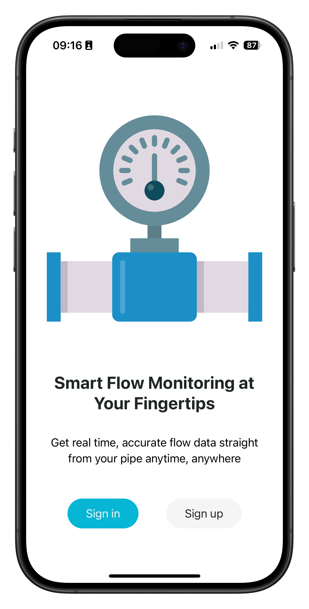
  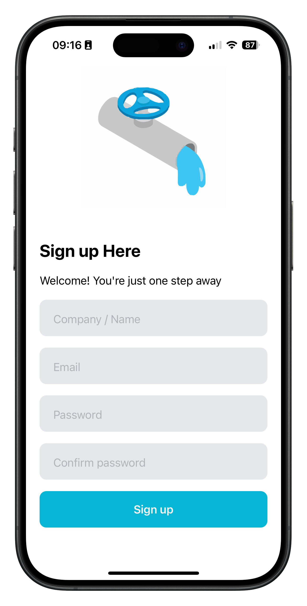
  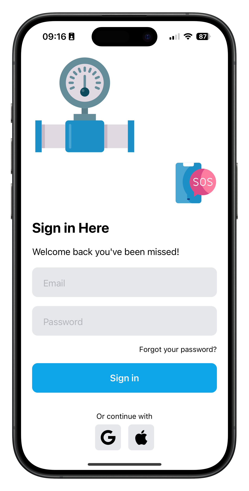
  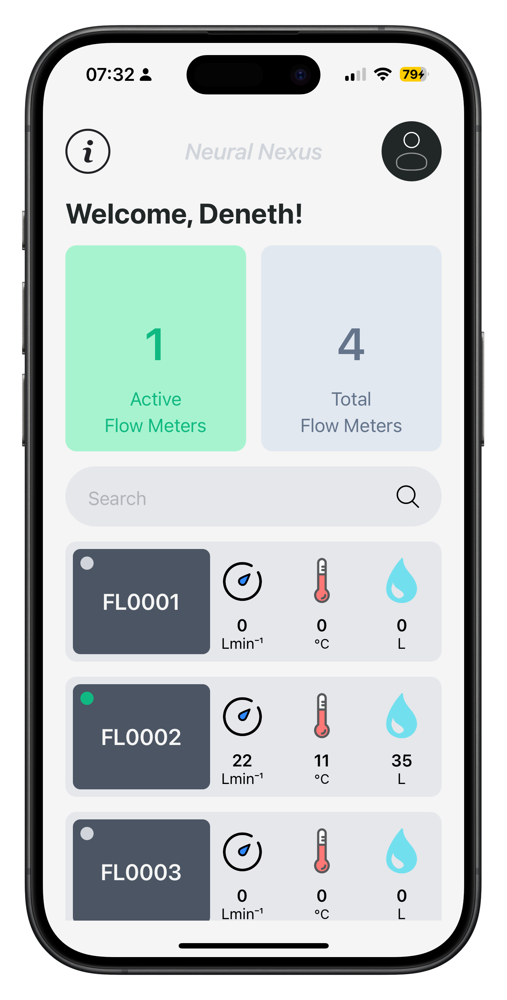
  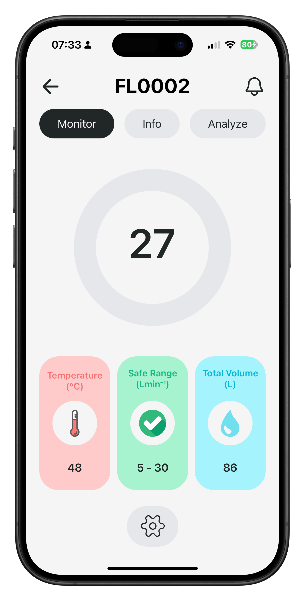
</p>

<p align="center">
  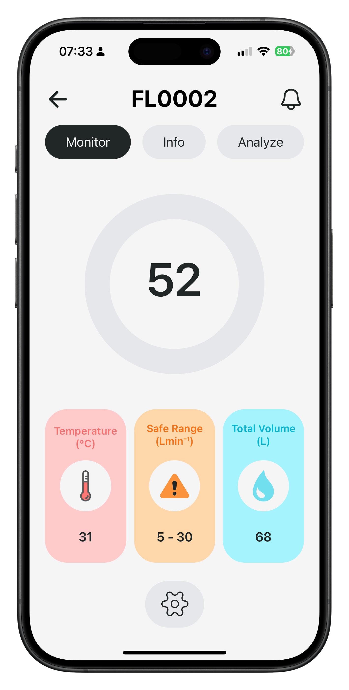
  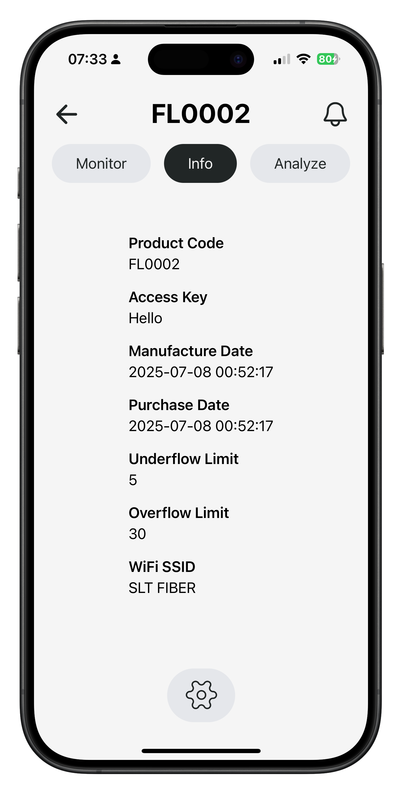
  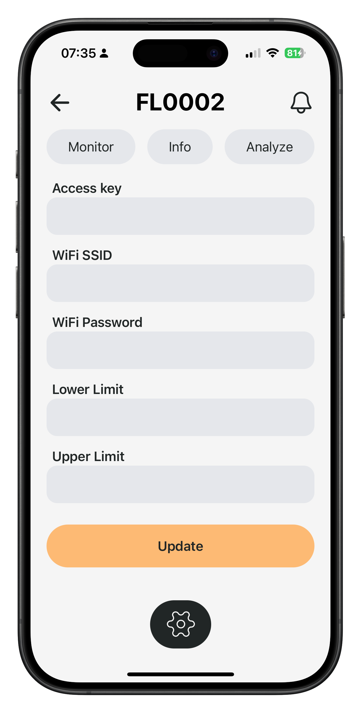
  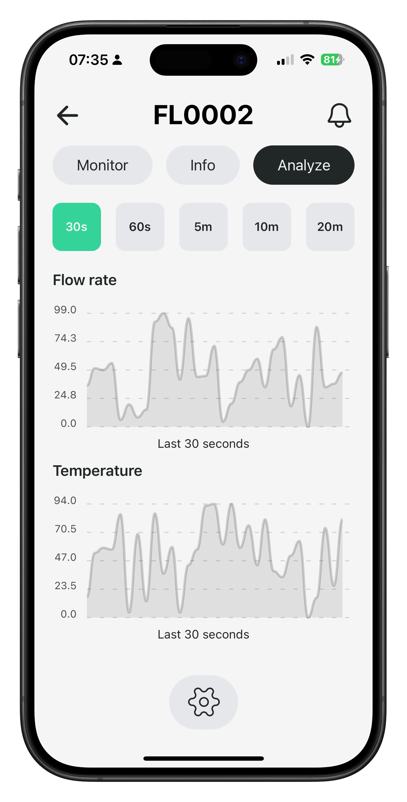
  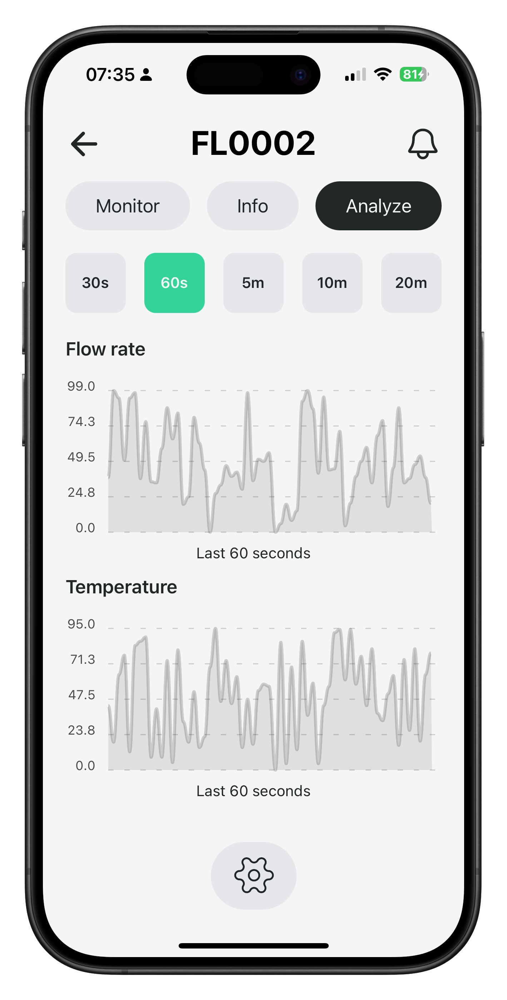
</p>

<p align="center">
  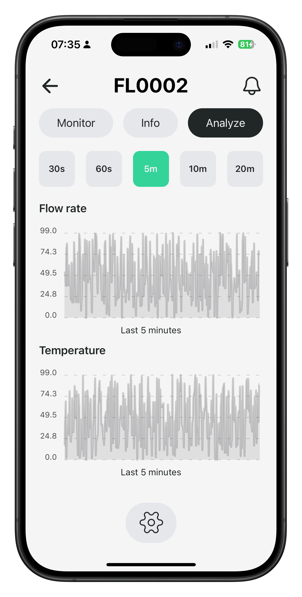
  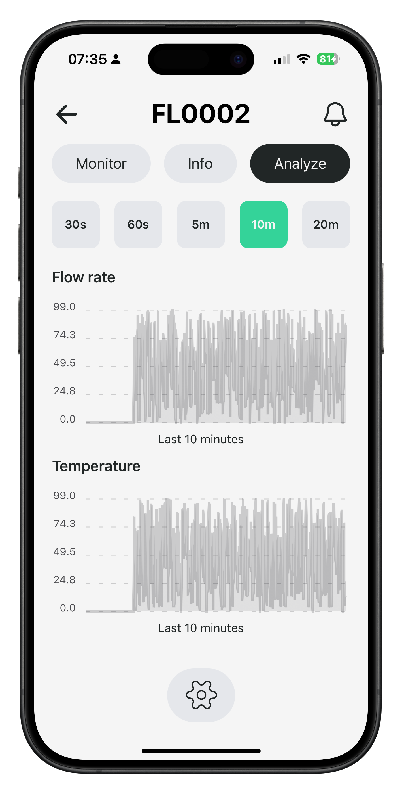
  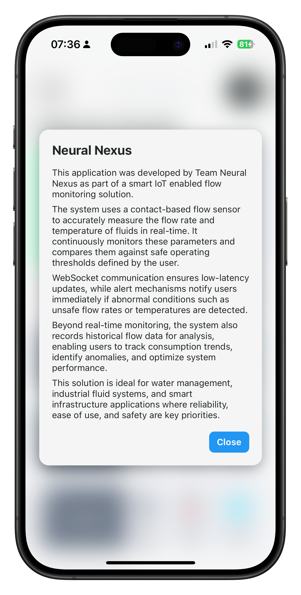
  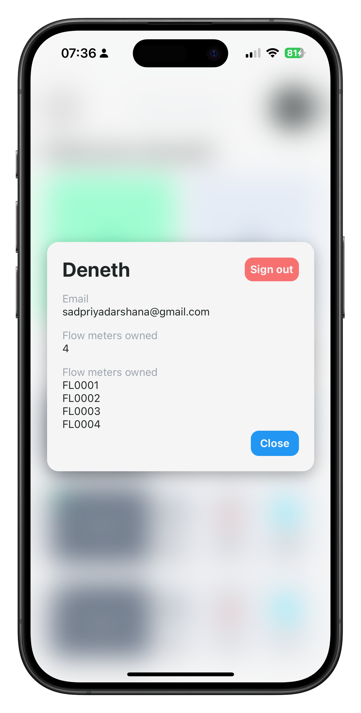
  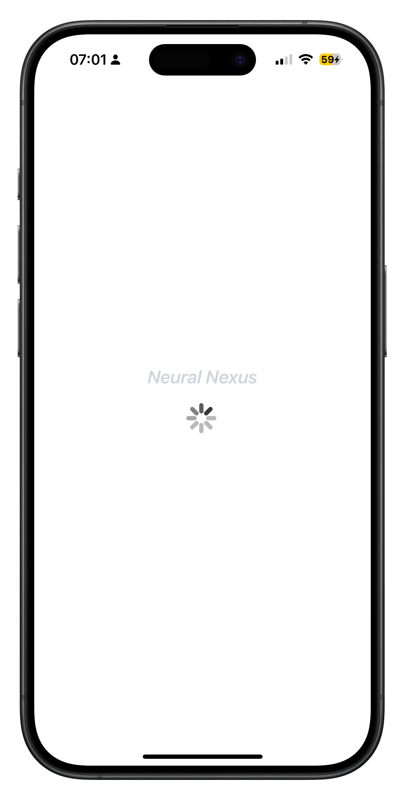
</p>

The React Native mobile application allows users to:

- Monitor live flow rate and water temperature
- View total water consumption
- Analyze historical flow data
- Configure flow limits
- Receive abnormal flow alerts
- Manage multiple devices
- View device information
- Securely authenticate using JWT

---

## 🎥 Project Demonstration

<p align="center">
  <a href="https://youtu.be/suSUBjm9vPg?si=0In6hv1Zi_KAKpei">
    
  </a>
</p>

<p align="center">
  <b>▶ Click the image above to watch the full project demonstration.</b>
</p>

---

## 🏗 System Architecture

```text
                  Water Flow
                       │
                       ▼
          Paddle Wheel Flow Sensor
                       │
                       ▼
                 ESP8266 MCU
         ┌─────────────┴─────────────┐
         │                           │
         ▼                           ▼
    OLED Display              Wi-Fi Communication
                                      │
                               WebSocket Server
                                      │
                                      ▼
                        React Native Mobile App
```

---

# 🔧 Hardware

| Component | Description |
|------------|-------------|
| ESP8266 | Main microcontroller |
| Paddle Wheel Flow Sensor | Water flow measurement |
| OLED Display | Local monitoring |
| TLV75733 LDO | 3.3V voltage regulation |
| TP4056 USB-C | Battery charging |
| Li-ion Battery | Portable power source |
| Custom PCB | Electronics integration |
| 3D Printed Enclosure | Product housing |

---

# 💻 Software Stack

| Layer | Technologies |
|---------|--------------|
| Embedded Firmware | Arduino (C++) |
| Mobile Application | React Native |
| Backend | Node.js |
| Database | SQLite |
| Communication | WebSockets, REST API |
| Authentication | JWT |

---

# 📊 Product Highlights

- Compact portable design
- Battery powered
- Accurate flow measurement
- Real-time wireless monitoring
- Historical analytics
- Cross-platform mobile application
- Low-cost hardware
- Easy installation
- Modular architecture
- Custom PCB design

---

# 📂 Repository Structure

```text
.
├── firmware/
│   ├── src/
│   ├── include/
│   └── lib/
│
├── App/
│   ├── src/
│   ├── assets/
│   └── package.json
│
├── Backend/
│   ├── server/
│   └── database/
│
├── Hardware/
│   ├── PCB/
│   ├── Schematics/
│   └── Enclosure/
│
├── images/
│
├── README.md
│
└── LICENSE
```

---

# 🚀 Getting Started

## Firmware

```bash
git clone https://github.com/yourusername/smart-flow-meter.git
```

Open the firmware project using the Arduino IDE.

Install the required libraries and upload the firmware to the ESP8266.

---

## Backend

```bash
cd Backend
npm install
npm start
```

---

## Mobile Application

```bash
cd App
npm install
npx expo start
```

---

# 🎯 Applications

- 🏠 Smart Homes
- 🌾 Agriculture & Irrigation
- 🏭 Industrial Water Monitoring
- 🚰 Municipal Water Supply
- 🌍 Water Conservation Systems

---

# 🔮 Future Improvements

- Cloud dashboard
- OTA firmware updates
- Leak detection
- AI-based water consumption prediction
- MQTT integration
- Multi-device synchronization
- Energy optimization
- Web dashboard

---

# 👥 Team Neural Nexus

<p align="center">

</p>

*The Neural Nexus team following the successful development of the Smart Contact-Based Flow Meter.*

| Team Member | Responsibility |
|-------------|----------------|
| **Deneth Priyadarshana** | Mobile Application Development (Android & iOS) |
| **Lasan Perera** | Circuit Design, Testing & Electronic Optimization |
| **Isitha Dinujaya** | Enclosure Design & Algorithm Development |
| **Dulana Pitiwaduge** | PCB Design & Market Analysis |

---

# 🎓 Academic Project

**Course**

EN1190 — Engineering Design Project

**Department**

Department of Electronic & Telecommunication Engineering

**Faculty**

Faculty of Engineering

**University**

University of Moratuwa

---

# 📄 License

This project was developed for academic and educational purposes as part of the EN1190 Engineering Design Project at the University of Moratuwa.
